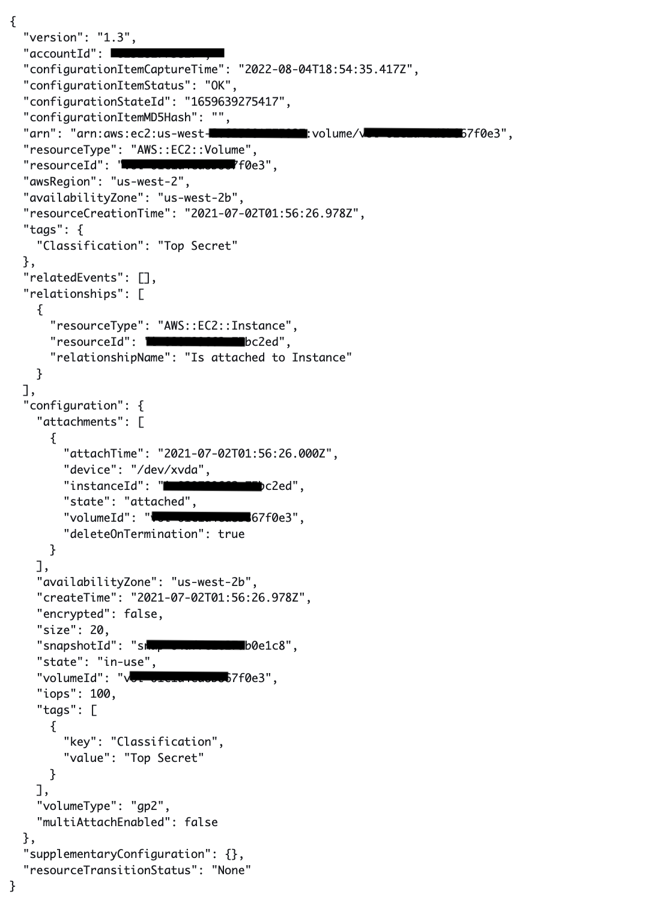
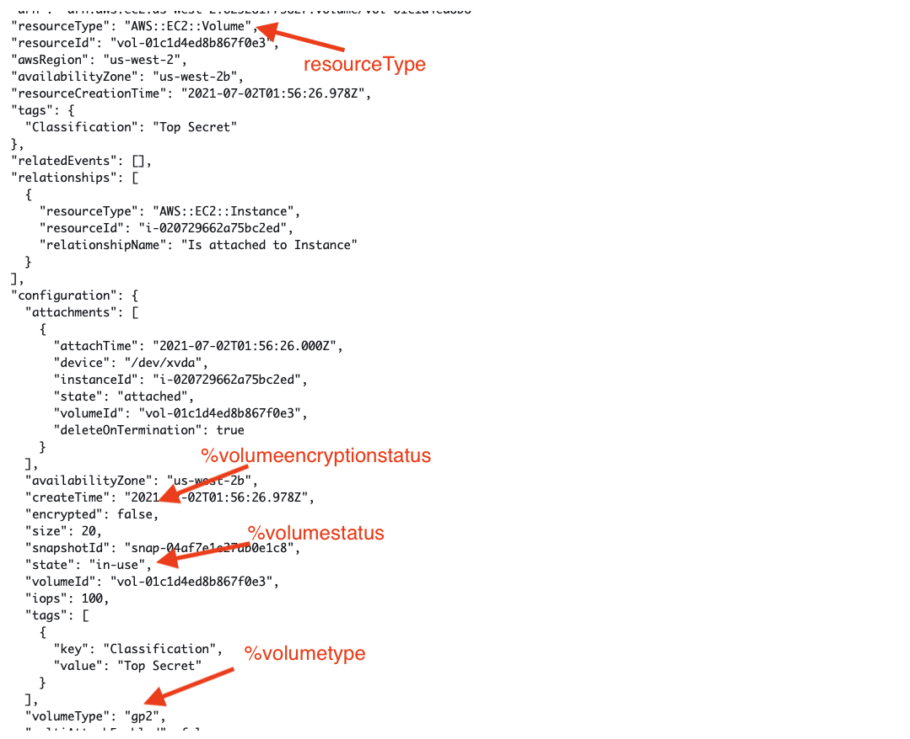
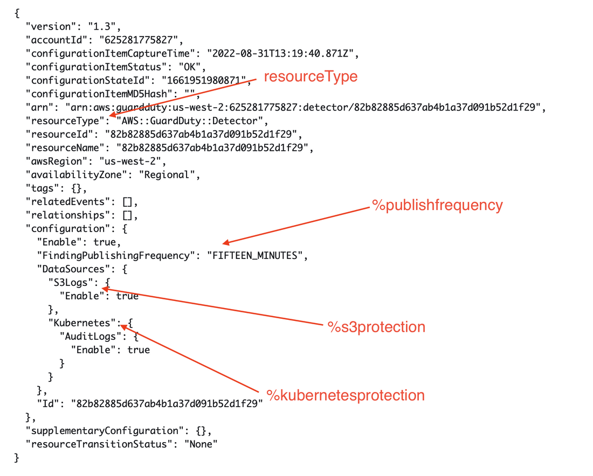

# AWS Config with CloudFormation Guard

AWS Config CloudFormation Guard Custom rules fit as a middle ground between Managed Rules and fully custom Lambda methods. This provides engineers and architects the ability to quickly build rules without needing to know Python, NodeJS, Java required in the other method to deploy custom rules.
This guide aims to accelerate the adoption of the feature by providing workable templates, code and deployment methods. By using this quick start document, an administrator will be able to leverage AWS Config to build custom compliance rules using Configuration Item attributes.

## Prerequisites

- An active AWS account.
- AWS Config must be enabled in your AWS account.

## Limitations

CloudFormation Guard Custom rules are only able to query key/value pairs in a given AWS Config Confirguration Item JSON record.

## Document Outcomes
As a Security Engineer or Operational Engineer, I want to be able to:
- Understand how CloudFormation Guard (cfn-guard) policy code interacts with the AWS Config service.
- Scenario 1 - Deploy a custom AWS Config Custom Rule using cfn-guard syntax to identify compliance for encrypted volumes, status of the drive as in-use AND of type GP3 for compliance.
- Scenario 2 - Deploy a custom AWS Config Custom Rule using cfn-guard syntax to identify all GuardDuty recorders are compliant by having S3 Protection and Kubernetes Protection enabled.

## AWS Config & CloudFormation Guard Overview
Integration Overview
AWS Config provides another method to build custom rules without having to use AWS Lambda functions written in NodeJS, Java or Python. This new method leverages CloudFormation Guard (cfn-guard), as a domain-specific-language (DSL) to build policies and check AWS Config Configuration Items (CI).

The cfn-guard syntax is applied to an AWS Config rule as a custom policy for the service to crawl the hierarchical JSON of each of the AWS Config resources specified.

The AWS Config Configuration Item JSON, which key-value attributes, will be used in the cfn-guard policy syntax as variables assigned to their corresponding value.  The variables when called in the syntax will be prepended with the ‘%’ value.  In the following screenshot, there are three values used as variables and a key of ‘resourceType’ is called out and used as a filter.

Example: EC2 Volume AWS Config - Configuration Item

## cfn-guard Syntax

### Syntax explanation of the cfn-guard

    # declare variable
    let <variable name> = <'value'>

    # create rule and assign condition and policy
        rule <rule name> when 
            <CI json key> == <"CI json value"> {
                <top level CI json key>.<next level CI json key> == %<variable name>
            }

### Implementation of cfn-guard syntax used in Scenario 1

    let volumestatus = 'available'
    let volumetype = 'gp3'
    let volumeencryptionstatus = true

        rule compliancecheck when 
            resourceType == "AWS::EC2::Volume" {
                configuration.state == %volumestatus
                configuration.encrypted == %volumeencryptionstatus
                configuration.volumeType == %volumetype
            }

## Scenario 1 - EC2 Volume
This scenario would set a custom AWS Config rule that would ensure all EC2 volumes that are not attached to an instance, are encrypted AND of the volume type GP3 would be compliant if matching the cfn-guard policy, otherwise it would be marked noncompliant.

In the following text block, the first three lines define the variables by using the ‘let’ command.  They are assigned a name and value, derived from attributes from the AWS Config CI JSON previously mentioned.

This next section of code is a rule block named ‘compliancecheck’ which adds a ‘when’ conditional dependency that looks for a key/value pair of ‘resourceType’ in the JSON of the CI matching ‘AWS::EC2::Volume’ and if it matched it will step through the rest of the JSON attributes and look for matches on the following three conditions of state, encrypted and volumeType. 

    let volumestatus = 'available'
    let volumetype = 'gp3'
    let volumeencryptionstatus = true

        rule compliancecheck when 
            resourceType == "AWS::EC2::Volume" {
                configuration.state == %volumestatus
                configuration.encrypted == %volumeencryptionstatus
                configuration.volumeType == %volumetype
            }

## Scenario 1 - EC2 Volume Solution CloudFormation Code
    AWSTemplateFormatVersion: "2010-09-09"
    Description: Create AWS Config Rule using CloudFormation Guard DSL
    Parameters:
    ConfigRuleName01:
        Type: String
        Default: GUARD-Rule-01
        Description: Name of the AWS Config Rule

    Resources:

    ConfigGuardRule01:
        Type: AWS::Config::ConfigRule
        Properties: 
        ConfigRuleName: !Ref ConfigRuleName01
        Description: Compliant if volume is available, type gp3, and encrypted conditions are met in resource
        Scope:
            ComplianceResourceTypes: 
            - "AWS::EC2::Volume"
        Source:
            Owner: CUSTOM_POLICY
            CustomPolicyDetails:
            EnableDebugLogDelivery: "True"
            PolicyRuntime: guard-2.x.x
            PolicyText: |
                let volumestatus = 'available'
                let volumetype = 'gp3'
                let volumeencryptionstatus = true

                    rule compliancecheck when 
                        resourceType == "AWS::EC2::Volume" {
                            configuration.state == %volumestatus
                            configuration.encrypted == %volumeencryptionstatus
                            configuration.volumeType == %volumetype
                        }
            SourceDetails: 
            - 
            EventSource: "aws.config" 
            MessageType: "ConfigurationItemChangeNotification"

## Scenario 1 - EC2 Volume Solution TerraForm Code
    resource "aws_config_config_rule" "example" {
        name        = "GUARD-Ec2Volume-TF"
        description = "compliant if volume is available, encrypted and GP3"

        scope {
        compliance_resource_types = ["AWS::EC2::Volume"]
        }
    
    
        source {
        owner = "CUSTOM_POLICY"
            
        source_detail {
            event_source = "aws.config"
            message_type = "ConfigurationItemChangeNotification"
        }
    
        custom_policy_details {
            policy_runtime = "guard-2.x.x"
            policy_text    = <<EOF
            let volumestatus = 'available'
            let volumetype = 'gp3'
            let volumeencryptionstatus = true

            rule compliancecheck when 
                resourceType == "AWS::EC2::Volume" {
                    configuration.state == %volumestatus
                    configuration.encrypted == %volumeencryptionstatus
                    configuration.volumeType == %volumetype
            }
    EOF                    
        }
        }
    }

## Scenario 2 - GuardDuty
This scenario could be deployed across an AWS Organization for all accounts and regions in order to detect if all GuardDuty detectors have S3 protection enabled, Kubernetes protection enabled AND findings are published every 15 minutes.

In the following text block, the first three lines define the variables by using the ‘let’ command.  They are assigned a name and value, derived from attributes from the AWS Config CI JSON previously mentioned.

This next section of code is a rule block named ‘compliancecheck’ which adds a ‘when’ conditional dependency that looks for a key/value pair of ‘resourceType’ in the JSON of the CI matching ‘AWS::GuardDuty::Detector’ and if it matched it will step through the rest of the JSON attributes and look for matches on the following three conditions of state, encrypted and volumeType. 

    let s3protection = true
    let kubernetesprotection = true
    let publishfrequency = 'FIFTEEN_MINUTES'

        rule compliancecheck when 
            resourceType == "AWS::GuardDuty::Detector" {
                configuration.DataSources.S3Logs.Enable == %s3protection
                configuration.DataSources.Kubernetes.AuditLogs.Enable == %kubernetesprotection
                configuration.FindingPublishingFrequency == %publishfrequency
            }

## Scenario 2 - GuardDuty Solution CloudFormation Code

    AWSTemplateFormatVersion: "2010-09-09"
    Description: Create AWS Config Rule using CloudFormation Guard DSL
    Parameters:
    ConfigRuleName01:
        Type: String
        Default: GUARD-Rule-01-GD
        Description: Name of the AWS Config Rule

    Resources:

    ConfigGuardRule01:
        Type: AWS::Config::ConfigRule
        Properties: 
        ConfigRuleName: !Ref ConfigRuleName01
        Description: Compliant if GuardDuty has S3 protection enabled, Kubernetes protection enabled AND Findings are published every 15 minutes.
        Scope:
            ComplianceResourceTypes: 
            - "AWS::GuardDuty::Detector"
        Source:
            Owner: CUSTOM_POLICY
            CustomPolicyDetails:
            EnableDebugLogDelivery: "True"
            PolicyRuntime: guard-2.x.x
            PolicyText: |
                let s3protection = true
                let kubernetesprotection = true
                let publishfrequency = 'FIFTEEN_MINUTES'

                    rule compliancecheck when 
                        resourceType == "AWS::GuardDuty::Detector" {
                            configuration.DataSources.S3Logs.Enable == %s3protection
                            configuration.DataSources.Kubernetes.AuditLogs.Enable == %kubernetesprotection
                            configuration.FindingPublishingFrequency == %publishfrequency
                        }
            SourceDetails: 
            - 
            EventSource: "aws.config"
            MessageType: "ConfigurationItemChangeNotification"

## Scenario 2 - GuardDuty Solution Terraform Code

    resource "aws_config_config_rule" "example2" {
        name        = "GUARD-GuardDuty-TF"
        description = "compliant if S3 protection enabled, Kubernetes protention enabled and publish frequency"

        scope {
        compliance_resource_types = ["AWS::GuardDuty::Detector"]
        }
        source {
        owner = "CUSTOM_POLICY"
            
        source_detail {
            event_source = "aws.config"
            message_type = "ConfigurationItemChangeNotification"
        }
    
        custom_policy_details {
            policy_runtime = "guard-2.x.x"
            policy_text    = <<EOF
            let s3protection = true
            let kubernetesprotection = true
            let publishfrequency = 'FIFTEEN_MINUTES'
            
                rule compliancecheck when 
                    resourceType == "AWS::GuardDuty::Detector" {
                        configuration.DataSources.S3Logs.Enable == %s3protection
                        configuration.DataSources.Kubernetes.AuditLogs.Enable == %kubernetesprotection
                        configuration.FindingPublishingFrequency == %publishfrequency
                    }
    EOF                    
        }
        }
    }